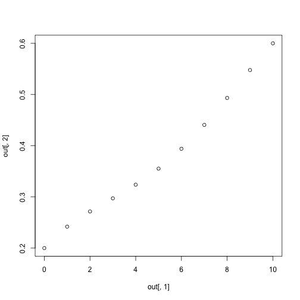

How to Solve Boundary Value Problems in R
=========================================

First, load the package


```r
library(bvpSolve)
```


Write a function that defines your differential equations and set some parameters


```r
bvpDES <- function(Time, State, Pars) {
    with(as.list(c(State, Pars)), {
        dx = a * x - b * (x^2) - y
        dy = (r - a + (2 * b * x)) * (alpha - (2 * beta * 
            y))/(-2 * beta)
        return(list(c(dx, dy)))
    })
}

parms <- c(alpha <- 0.4675, beta <- 1, a <- 1.1, 
    b <- 1.1, r <- 0.1)
```


Set your initial and boundary conditions.  Use `NA` to for your unknown boundary conditions.  Also create a vector of times for the output data.


```r
x0 <- 0.2
xT = 0.6
T <- 10
yini <- c(x = x0, y = NA)
yend <- c(x = xT, y = NA)
times <- seq(0, T, length.out = (T + 1))
```


Use the function `bvpshoot` to solve the problem.  I recommend specifying `method="bdf"` if you have a stiff system of equations or are sensitive to initial conditions.  You must also specify a guess.


```r
out <- bvpshoot(yini = yini, x = times, func = bvpDES, 
    yend = yend, parms = parms, guess = 0.1, method = "bdf")

out
```


```
##     x      x      y
## 1   0 0.2000 0.1237
## 2   1 0.2419 0.1677
## 3   2 0.2715 0.1910
## 4   3 0.2971 0.2043
## 5   4 0.3238 0.2123
## 6   5 0.3553 0.2171
## 7   6 0.3940 0.2198
## 8   7 0.4407 0.2209
## 9   8 0.4933 0.2206
## 10  9 0.5478 0.2185
## 11 10 0.6000 0.2140
```


Now plot the results:


```r
plot(out[, 1], out[, 2])
```

 

